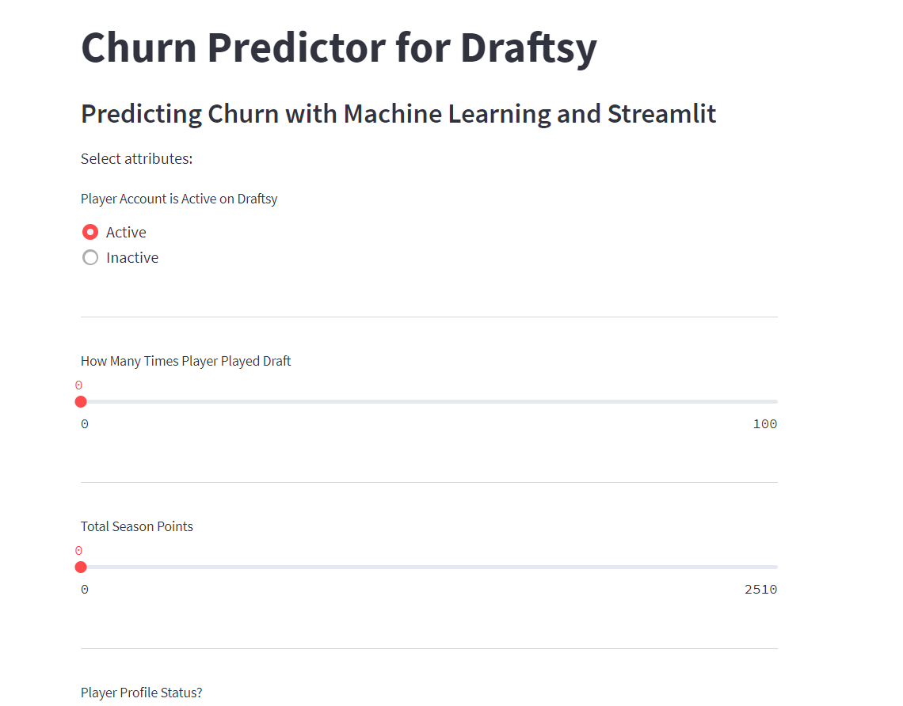
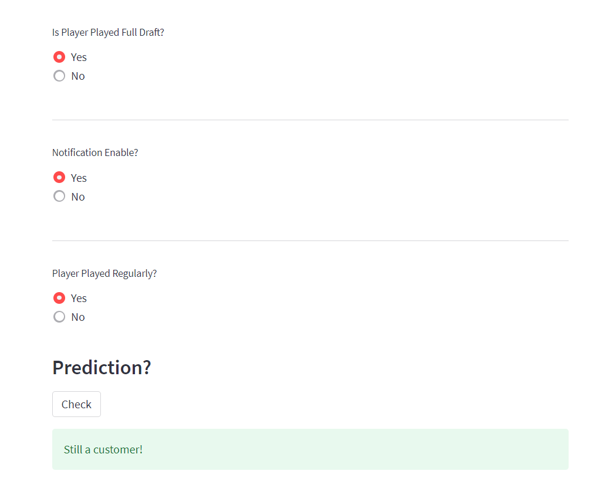

Wasn't expecting to build the app but here we are.

And this is how it predicts results.

**Requirements**  

streamlit>=0.57.3  
matplotlib>=3.2.1  
numpy>=1.18.2  
pandas>=1.0.3  
joblib>=0.14.1  
scikit-learn>=0.22.2  
scipy>=1.4.1  
pip>=20.0.2  
seaborn>=0.10.0  

**Installation**

Once you install requirements.txt, just do streamlit run main.py

